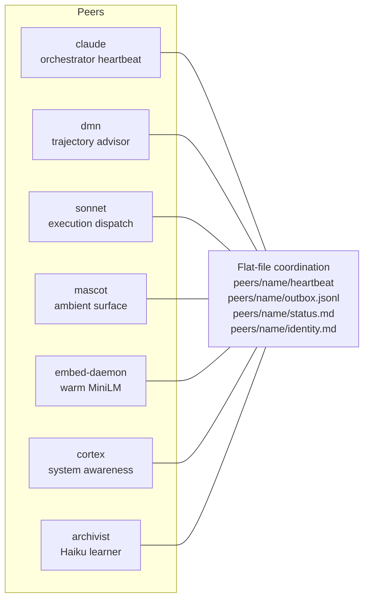

# atrium

   

Workspace primitives for treating Claude as a co-inhabitant, not a tool.

> **This is a published artifact, not a maintained project.**
> **Last verified:** 2026-04-25.

> **If you arrived here cold:** read [`captain-meridian-stack-public`](https://github.com/Upua/captain-meridian-stack-public) first — it has the philosophy (`LANDSCAPE.md`, `ARCHITECTURE.md`, `ROADMAP.md`) that makes the code in this repo legible. Without that context, this repo will read as a pile of cognitive-verb shell scripts.

---

## What this is

Working code from one person's daily-driver personal AI infrastructure. About thirty `atrium-*` shell verbs (cognitive primitives), a small Python lib (`lib/atrium_notify.py` and helpers), philosophy docs (`AGENTS.md`, `PRINCIPLES.md`, `PATTERNS.md`), and the brain corpus (`brain/decisions/`, `brain/idea-*.md`, templates) that explains the patterns.

**About `brain/`:** durable agent memory for the workspace. What lives here: design docs (`idea-*.md`), decision records (`decisions/`), templates for task/handoff/implementation-plan, the build narrative (`GROWTH.md`), the system mission. What does *not* live here: live working state (handoffs from real sessions, current task, walkthrough) and runtime state (peer heartbeats, traces, embedding previews) — those live in the private dev repo this artifact was extracted from.

This is the workspace half. The narrative + roadmap + competitive landscape live in [`captain-meridian-stack`](https://github.com/Upua/captain-meridian-stack-public).

## What this isn't

- A framework you can `pip install`
- A maintained project with issues, PRs, and a roadmap driven by users
- Multi-provider, portable, generalized, or production-hardened
- Useful as-is on your machine without significant adaptation

## The peer model at a glance

Peers don't talk over an API. They write files. The orchestrator (a Claude session) drains outboxes, reads heartbeats, and addresses peers by directory name. Adding a peer is creating a directory.

## How to read this repo

1. Start with [`AGENTS.md`](AGENTS.md), [`PRINCIPLES.md`](PRINCIPLES.md), [`PATTERNS.md`](PATTERNS.md) — the operating philosophy
2. Then [`brain/idea-a0-embed-daemon.md`](brain/idea-a0-embed-daemon.md) (persistent warm-MiniLM embed daemon over UNIX socket), [`brain/idea-b-dmn-peer.md`](brain/idea-b-dmn-peer.md) (Default Mode Network as a trajectory-advisor peer), [`brain/idea-a4-recall-feedback.md`](brain/idea-a4-recall-feedback.md) (recall-usefulness feedback loop) — the load-bearing patterns
3. Then [`bin/`](bin/) — the actual cognitive verbs as shell scripts
4. Then [`brain/GROWTH.md`](brain/GROWTH.md) — how it got here

If you want to understand the system, read the philosophy first and the code second. The code only makes sense once you accept the framing.

## What "artifact, not project" means

- **No issues accepted.** This isn't a place to file bug reports or feature requests.
- **No PRs accepted.** Adapt patterns into your own fork; don't expect upstream merges.
- **No support promised.** The author has a day job and uses this every day, but doesn't owe time to questions.
- **No promises about updates.** This is a snapshot. If the "Last verified" date in this README is six months stale when you find it, the patterns are still here, but the live system has moved on.

If those boundaries don't work for you, that's fine — read the patterns, build your own version with your own stack.

**If this inspired you, build your own version and link it back.** A network of personal-AI-infrastructure attempts beats one canonical fork — different operators will solve different parts well.

## What's stubbed

Two pieces are present but not fully wired:

- `atrium-notify --modality voice` is stubbed — it logs "voice route requested but not yet implemented" and exits 0. Voice wiring (Kokoro/voicemode RPC) is Phase 2.2b in the [ROADMAP](https://github.com/Upua/captain-meridian-stack-public/blob/main/ROADMAP.md).
- The `state/`, `snapshots/`, and `peers/` runtime directories from the dev repo are intentionally NOT included — they hold ephemeral session state and would re-pollute on first run anyway.

## Key Atrium verbs

A reading-guide snapshot (2026-04-25) of the verbs reached for most often during a session. The full set (~35) lives in [`bin/`](bin/) — see `atrium-help` for the live index.

| Command | What it does (from the script's own header) |
|---|---|
| `atrium-session-begin` | Single entry point that bootstraps an Atrium working session cleanly |
| `atrium-recall` | Lexical + semantic search over Atrium's memory surfaces |
| `atrium-embed-daemon` | Persistent Python process holding MiniLM warm; serves embeds over a UNIX socket |
| `atrium-embed-source` | Store / query embeddings across registered memory surfaces |
| `atrium-vault` | Browse and search the Obsidian vault from the terminal |
| `atrium-decide` | Log a non-trivial decision in `brain/decisions/` |
| `atrium-handoff` | Write `brain/handoff.md` so the next instance starts oriented |
| `atrium-plan` | Plan-gated execution ritual — makes `brain/implementation_plan.md` checkboxes LIVE state |
| `atrium-peer` | Flat-file peer coordination (heartbeat / outbox / status / identity) |
| `atrium-trace` / `atrium-tail` | Append one event to `state/trace.jsonl` / pretty-print recent events |
| `atrium-notify` | Unified operator notification primitive (urgency × modality routing) |
| `atrium-help` | Print the live verb index |

Verbs operate on flat files and small shared services. There is no central runtime; the verbs *are* the runtime.

## License

Dual-licensed by file type:

- **Code** (`bin/*`, `lib/*.py`, `kitty/*`, `zellij/*`, `design/*.css`, `design/*.html`) — **Apache License 2.0**. See [LICENSE](LICENSE). Permissive, with explicit patent grant.
- **Writing** (`AGENTS.md`, `PRINCIPLES.md`, `PATTERNS.md`, `README.md`, `brain/*.md`, `design/DESIGN-SYSTEM.md`) — **Creative Commons BY-NC-SA 4.0**. See [LICENSE-CONTENT](LICENSE-CONTENT). Adapt freely for non-commercial use, attribute, share-alike.

See [NOTICE](NOTICE) for the file-type breakdown, the embedded-code-block rule, and the (non-binding) preference statement on AI training data.

The code is permissive; the writing has guardrails against commercial repackaging. The philosophy doesn't transfer by copying — you'll have to live with your own version a while before it becomes yours.

## Companion repo

[`captain-meridian-stack`](https://github.com/Upua/captain-meridian-stack-public) — meta repo with `ROADMAP.md`, `ARCHITECTURE.md`, `LANDSCAPE.md` (where this sits in the 2026 ecosystem), and the build narrative.

For the long-form essay introducing the philosophy, see [Building a home for an AI](https://github.com/Upua/captain-meridian-stack-public/blob/main/docs/posts/2026-04-25-building-a-home-for-an-ai.md).

## Author

Upua (`Upua` on GitHub). Built collaboratively with Claude (Opus and Sonnet). The collaboration is named in the writing because the framing was earned through it, not stipulated.
