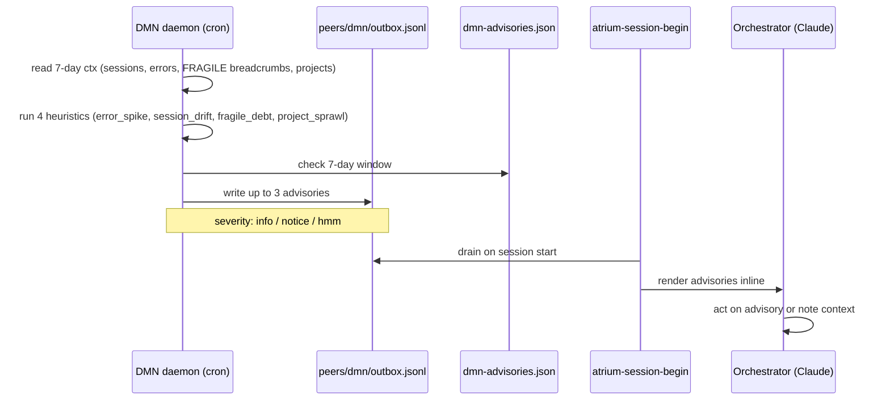

# Idea B — DMN as a Peer (LIVE)

**Session:** 2026-04-24 (continuation after A.0 ship)
**Status:** in flight
**Tail path:** `~/Atrium/brain/idea-b-dmn-peer.md`

## Flow at a glance

## Goal
Turn the DMN daemon from a write-only self-model generator into a **peer** that can surface advisory messages to the orchestrator. Closes the loop: DMN already sees the trajectory (session counts, error rates, fragile debt, project sprawl) but its output is read only at session-start via the embodied-startup script. B makes it proactive — "the previous instance noticed X, you should know".

## Design

**Peer:** `dmn` (separate from `claude` which is the orchestrator's own heartbeat peer).
**Channel:** `peers/dmn/outbox.jsonl` — dmn writes, orchestrator drains via `atrium-peer recv dmn`.
**Emission:** end of every `dmn-daemon.py` run. Heuristics-only (no LLM call). Max 3 advisories/run.
**Dedup:** `~/.claude/cache/dmn-advisories.json` — same advisory_key doesn't repeat within 7 days.
**Severity:** `info` (FYI) / `notice` (worth a glance) / `hmm` (something shifted).
**Consumer:** `atrium-session-begin` new step drains + prints them. Orchestrator sees the banner at session start.

## Advisory heuristics (initial four)

1. **Error spike.** error_count_7d vs. 7-day rolling avg from prior runs. +50% → `notice`. +100% → `hmm`.
2. **Session drift.** avg_duration_min trending up while error rate also up → `hmm` (possible stuck/scope creep). Drifting down while session_count low → `info` (cooling down, not a problem).
3. **Fragile debt.** count of FRAGILE breadcrumbs > 5 in last 7d → `notice`.
4. **Project sprawl.** active_projects count > 4 → `info` (context-switching cost).

Heuristic output is a `(kind, subject, severity, message)` tuple; kind+subject is the dedup key.

## Reversibility

- Zero schema change. Only new files: `peers/dmn/*` (matches pattern) and `~/.claude/cache/dmn-advisories.json`.
- Disable: `rm -rf ~/Atrium/peers/dmn` — next dmn run will recreate, or just delete `~/.claude/scripts/dmn-daemon.py` advisories section.
- Atrium-session-begin drain is additive (new step), easy to revert.

## Execution log

### 2026-04-24 08:55 — B.0–B.3 shipped

- **B.0** `ensure_dmn_peer()` added to dmn-daemon.py — idempotent, refreshes heartbeat + status.md on every run, creates outbox.jsonl if absent. Confirmed: `~/Atrium/peers/dmn/` now live with heartbeat.json + outbox.jsonl + status.md.
- **B.1** Four heuristics wired (error_spike, session_drift, fragile_debt, project_sprawl). Deterministic, no LLM. Cap 3 advisories/run. Validated with synthetic ctx: all four fire, first three emitted, fourth deferred by cap — correct.
- **B.3** Dedup at `~/.claude/cache/dmn-advisories.json`, 7-day window. Validated: second call with same advisories emits 0 duplicates + 1 new (the one capped out first time). Severity tiers `info` / `notice` / `hmm` rendered with icons (· / ℹ / ⚠).
- **B.2** `atrium-session-begin` step 7 drains `peers/dmn/outbox.jsonl` via `atrium-peer recv dmn` (auto-truncates) and renders each advisory on its own line. Tested end-to-end with seeded outbox — 3 advisories in, 3 rendered, outbox empty after.
- **Live with current data:** running today's real ctx through the heuristics yields **0 advisories** (20 sessions/7d, 0 errors, 3 FRAGILE, 3 projects — nothing triggers). Thresholds are calibrated for signal, not noise.
- **Cron intact:** DMN daemon scheduled `23 */4 * * *` with user-active gate. Next run ~12:23 will produce the first real advisories-from-production pass.

### Files touched

- `~/.claude/scripts/dmn-daemon.py` (+~150 lines: peer helper, 4 heuristics, dedup, emission)
- `~/Atrium/bin/atrium-session-begin` (+21 lines: step 7 drain)
- `~/Atrium/peers/dmn/` (new peer dir — auto-created on next DMN run)
- `~/.claude/cache/dmn-advisories.json` (new dedup state — auto-created)

### What unblocks / closes

- DMN is no longer write-only — its observations reach the orchestrator automatically.
- Closes the "self-model is narrative but silent" gap. Advisories are proactive.
- Tone risk is managed by: deterministic triggers + dedup + max 3/run + severity tiers. Easy to dial if noisy in practice.
